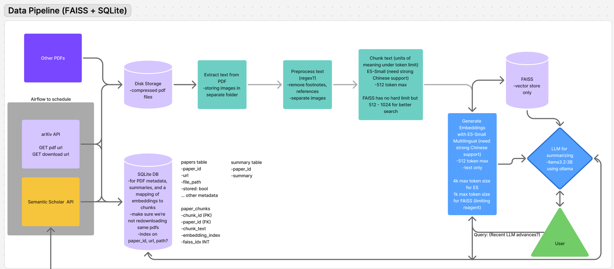

# Research Paper Processing and Search System

A system for processing, indexing, and searching research papers using modern NLP techniques. This project enables efficient semantic search across research papers by leveraging FAISS for vector similarity search and the E5 model for generating high-quality embeddings.

## Features

- **Paper Processing Pipeline**
  - Automated fetching of papers from ArXiv
  - PDF text and image extraction
  - Text chunking and preprocessing
  - Embedding generation using E5 model
  - Efficient storage using FAISS and SQLite

- **Search Capabilities**
  - Semantic search across paper contents
  - Fast approximate nearest neighbor search using HNSW indexing
  - Retrieval of relevant text chunks with metadata

## System Architecture



Data Flow:
1. ArXiv Fetcher retrieves papers and stores metadata in SQLite
2. PDF Extractor processes papers to extract text and images
3. Text Chunker breaks content into manageable segments
4. E5 Embedder generates embeddings for text chunks
5. FAISS Index stores embeddings for fast similarity search
6. Search Interface enables semantic search using FAISS
7. LLM (via Ollama) provides additional processing capabilities

## Installation

1. Clone the repository:
```bash
git clone https://github.com/yourusername/summarize_research_papers.git
cd summarize_research_papers
```

2. Create and activate a conda environment:
```bash
conda env create -f env.yaml
conda activate research_papers
```

3. Install additional dependencies:
```bash
brew install ghostscript  # Required for PDF processing
```

4. Set up Ollama for LLM integration (optional):
```bash
# Follow Ollama installation instructions for your platform
```

## Usage

1. Configure your environment:
   - Add PYTHONPATH in VSCode settings:
     ```json
     "terminal.integrated.env.osx": { "PYTHONPATH": "${workspaceFolder}" }
     ```

2. Run scripts from the root folder:
```bash
python -m folder.file_name
```

## Project Structure

- `data_pipeline/`: Core data processing components
  - `arxiv_api.py`: ArXiv paper fetching
  - `extract/`: PDF text and image extraction
    - `pdf_extractor.py`: PDF text and image extraction using PyMuPDF
    - `chunker.py`: Text chunking for manageable segments
    - `text_preprocessor.py`: Text cleaning and preprocessing
  - `generate_embeddings.py`: E5 model for embedding generation
- `database/`: Data storage and indexing
  - `faiss_index.py`: FAISS vector similarity search
  - `sqlite_db.py`: SQLite database management
- `utils/`: Helper functions and configurations

## Development

### Running Tests
```bash
# TODO: Add test commands
```

### Future Improvements
- Implement image embedding generation
- Add batch processing for embeddings
- Improve DOI extraction from ArXiv
- Add integration tests
- Set up CI/CD pipeline

---


### FUTURE IMPROVEMENTS:
-not getting doi from arxiv (null in DB)... look into this
-> find article with doi and ensure it's being extracted properly


